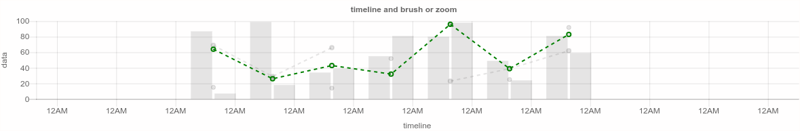
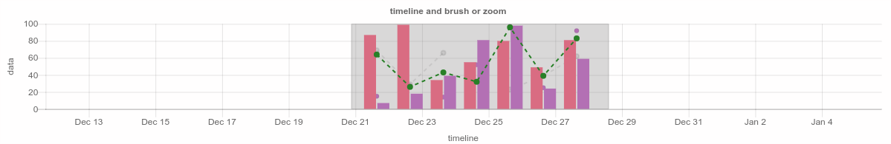
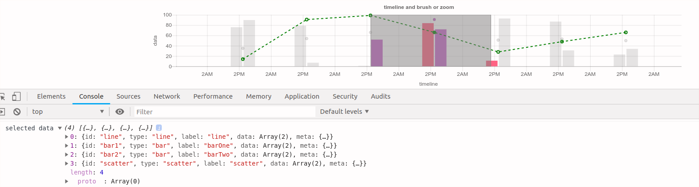

# chartjs-plugin-timeline

A timeline plugin for Chart.js Currently requires Chart.js >= 2.6.0

Support zoom and selection and change chart color brush

## Examples




Out of the box examples are available here: 

## Configuration

To configure the timeline and brush and zoom plugin, you can simply add new config options to your chart config.

```javascript

{
    title:{
        ...
    },
    scales: {
        ...
    },
    // Container for timeline options
    timeline: {

        // selected chart style
        selected: {
            style: [{
                _id: 'line',
                color: 'green'
            }, {
                _id: 'bar1',
                color: 'rgb(255, 99, 132)'
            }, {
                _id: 'bar2',
                color: 'rgb(200, 104, 204)'
            }, {
                _id: 'scatter',
                color: 'rgb(200, 104, 204)'
            }],
            // open toggle style
            toggleStyle: true
        },
        zoom: {
            enabled: true,
            sensitivity: 1
        },
        // brush default status
        brushDisplay: false,
        xAxesWidth: 60,
        onSelected: function(data) {
            console.log('selected data', data);
        },
        onClick: function(element) {
            console.log('click data', element);
        }
    }
}

```

## Started
- npm install http-server -g
- http-server ./

## To-do items
- auto play brush

## Building
- npm install 
- npm run watch

## License
`chartjs-plugin-timeline` is available under the [MIT license](LICENSE.md).